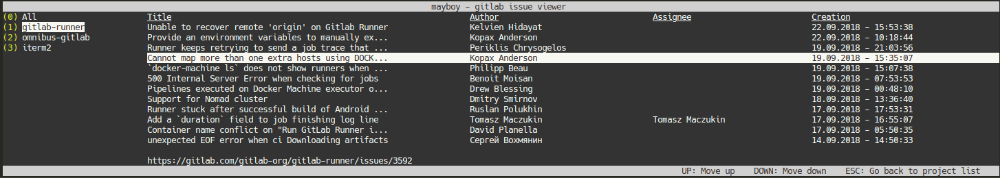

[](https://goreportcard.com/report/github.com/windler/mayboy) [](https://codebeat.co/projects/github-com-windler-mayboy-master)

# mayboy
This tool lets you list gitlab issues for multiple projects at once. With mayboy you can get an overview of all issues of your projects. These issue do not have to be assigned to you.

# Features
* List gitlab issues for multiple projects located on the same host
* List all projects in one table or separately in one table per project
* Get basic information about issues like title or author
* Get link to issue



## Installation
You need have go installed to install and run mayboy. To install mayboy, run:

```shell
go get -u github.com/windler/mayboy
```

Next, create a config-file calles `.mayboy` in your home directory `~` with the following contents:

```yaml
gitlabHost: "https://gitlab-host.com" #gitlab host name
accessToken: "secret-api-access-token-for-general-use" #api access token if neccessary
maxIssues: 50 #defaults to 20
includeAll: true #defaults to false
projects: #projects to show. Name->id
    Project1: <id>
    Project2: <id>
projectAccessTokens: #optional. Define specific acces tokens for some projects
    Project1: "token-for-project-1"
```

Assuming your `$GOPATH/bin` is located within your `$PATH` you can just run `mayboy` to run the app.